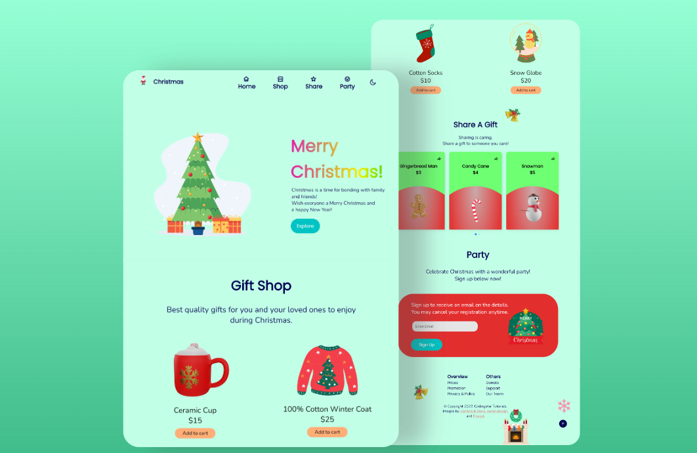

# Responsive Christmas Website Template

Get Full Source Code: https://www.buymeacoffee.com/cstutorials/e/101343

Full Video Tutorial: https://youtu.be/jjslzo4TWk4

This Website Template contains:
<ul>
    <li>A preloader that shows before the page completes loading</li>
    <li>A navigation bar that is fixed at the top of the screen   and can direct to a section of the website</li>
    <li>Pop up modals onclick</li>
    <li>Swiper to swipe multiple containers</li>
    <li>Sign up form design</li>
    <li>Dark/Light mode toggle</li>
    <li>Slide in when in view</li>
    <li>Compatible with most devices' screens, such as mobile phones</li>
    <li>A website favicon</li>
<ul>
 
Join this channel to see more tutorials like this responsive website! (Codingstar Tutorials)[https://www.youtube.com/@CodingstarTutorials]
 

